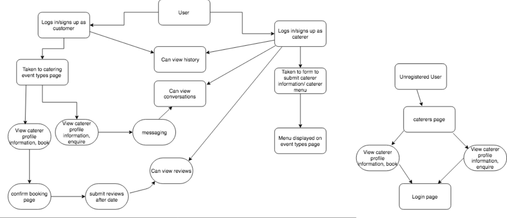
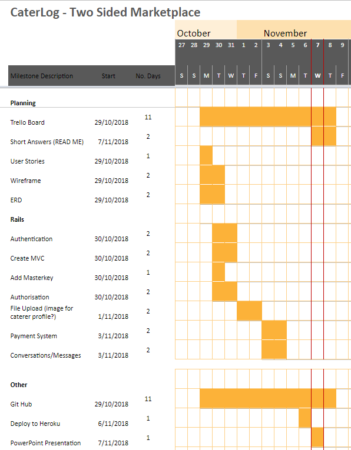
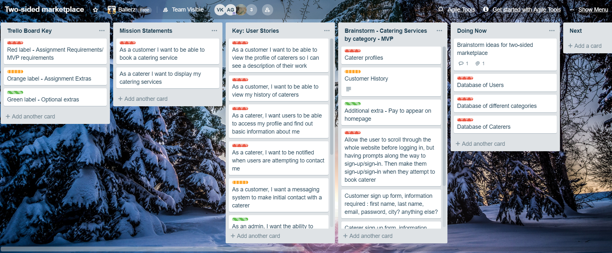

# CaterLog: A two-sided marketplace

### Collaborators

Allan Gao [Link to Github](https://github.com/e3cd)

Hamish Lees [Link to Github](https://github.com/hamlees93)

Veomany Khammarath [Link to Github](https://github.com/Veomany)

### [Website Link]

### Github Repository

[Link to Github Repository](https://github.com/e3cd/cater_log)

## About

CaterLog is a two-sided marketplace built with Ruby on Rails.

### Features

### Installation

```
git clone https://github.com/e3cd/cater_log.git
```
```
bundle install
```
```
rails db:create
```
```
rails db:migrate
```

### Tech stack

* Ruby on Rails version 5.2.1
* Ruby version 2.5.1
* HTML5
* CSS3
* Sass
* Bootstrap
* Heroku (deployment)

### Design Process

#### Wireframes
[Wireframe Mobile](docs/CaterLog-Mobile-View.png)

[Wireframe Desktop 1](docs/CaterLog-Desktop-Home-Page.png)

[Wireframe Desktop 2](docs/CaterLog-Desktop-Sign-In-Caterer.png)

[Wireframe Desktop 3](docs/CaterLog-Desktop-Customer.png)


#### Database ERD


### User stories

* As a customer I want to be able to view the profile of caterers so I can see a description of their work.
* As a customer, I want to be able to view my history of  caterers.
* As a caterer, I want users to be able to access my profile and find out basic information about me.
* As a caterer, I want to be notified when users are attempting to contact me.
* As a customer, I want a messaging system to make initial contact with a caterer.
* As a customer, I want to easily sign-up for an account, without having to jump through too many hoops
* As a caterer or a customer, I want to know that my information is protected
* As a customer, I want to be able to see reviews from other customers
* As an admin, I want the ability to monitor reviews and messages, and delete any inappropriate content

### A workflow diagram of the user journey



### Project plan & timeline



### Trello board


### Answers to the Short Answer questions
[Link to short answers](docs/short-answer.md)