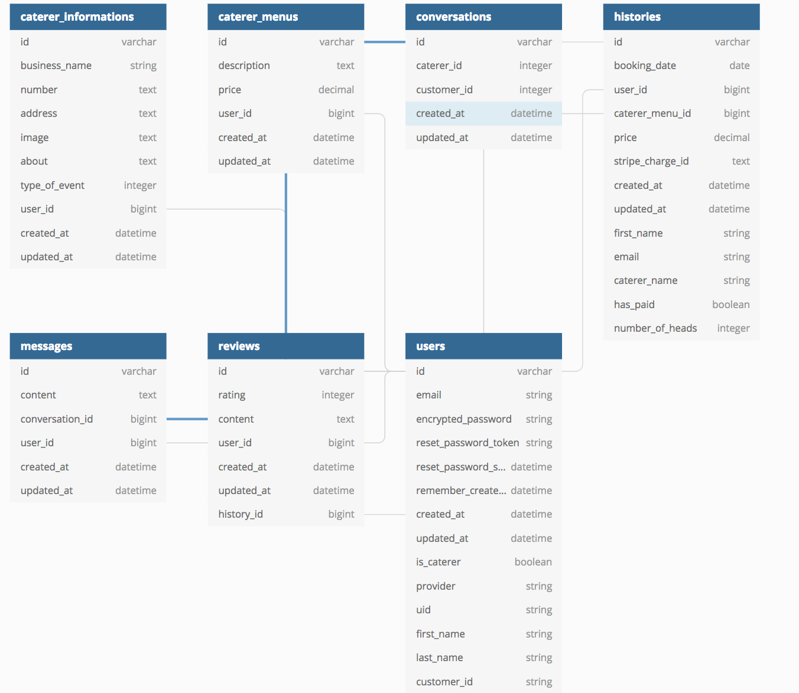

# CaterLog: A two-sided marketplace

### Collaborators

Allan Gao [Link to Github](https://github.com/e3cd)

Hamish Lees [Link to Github](https://github.com/hamlees93)

Veomany Khammarath [Link to Github](https://github.com/Veomany)

### [Website Link](https://caterlog.herokuapp.com/)

### Github Repository

[Link to Github Repository](https://github.com/e3cd/cater_log)

## About

When people are organising an event, there are several different things that must be considered. One of the most crucial; what food will there be. This is a decision that can take hours, pouring over individual caterer websites, reading reviews and comparing prices. Through the implementation of our app, CaterLog, we are addressing the need for customers to have access to all caterers in Sydney, in one convenient location, saving them time and money. 

CaterLog is a two-sided marketplace where caterers can sign up and list their catering menus, whilst customers looking for caterers can sign up and view menu options from caterers. They can subsequently enquire the caterer using a messaging system and then confirm their booking after a successful transaction.

### Features

The features of CaterLog include:

*The creation of authenticated user accounts as caterers or customers looking for caterers
*A messaging feature between caterers and customers
*Booking caterer menus using Stripe
*The ability as a customer to leave reviews on a caterer menu page
*A customer purchase history and a caterer menu history 
*The ability for customer to make a purchase and return to purchase if needed

### Installation and setting up the App.

On your terminal, navigate to a directory where you would like to save the app directory. Run the command line
```
git clone https://github.com/e3cd/cater_log.git
```
Change into the app directory by running``` cd cater_log ``` and run the following command to install the necessary ruby gems
```
bundle install
```
Create and migrate a new database by running
```
rails db:create
```
```
rails db:migrate
```
Initiate the rails server
```
rails db:migrate
```
Locate the app by typing in the web address ``` http://localhost:3000/ ``` in your browser

### Tech stack

* Ruby on Rails version 5.2.1
* Ruby version 2.5.1
* HTML5
* CSS3
* Sass
* Balsamiq (wireframing)
* Bootstrap
* Heroku (deployment)


### Design Process

The project timeline consisted of 9 working days, of which the first day was used to construct the layout and design. To draw inspiration we researched through various major two-sided marketplaces such as Airtasker and Airbnb. We then constructed wireframes using balsamiq to give us an idea of the user journey as they navigate through the app. The full wireframe set can be viewed Here. Links to our wireframe set below:  

#### Wireframes
[Wireframe Mobile](docs/CaterLog-Mobile-View.png)

[Wireframe Desktop 1](docs/CaterLog-Desktop-Home-Page.png)

[Wireframe Desktop 2](docs/CaterLog-Desktop-Sign-In-Caterer.png)

[Wireframe Desktop 3](docs/CaterLog-Desktop-Customer.png)


#### Database ERD

Upon completing the wireframes, the next task was to establish a entity relationship diagram (ERD). This is a crucial step in developing a fully functional app as it allowed us to establish the correct relationships between different database models, as well as identify their respective attributes and data types. 



### User stories

* As a customer I want to be able to view the profile of caterers so I can see a description of their work.
* As a customer, I want to be able to view my history of caterers.
* As a caterer, I want users to be able to access my profile and find out basic information about me.
* As a caterer, I want to be notified when users are attempting to contact me.
* As a customer, I want a messaging system to make initial contact with a caterer.
* As a customer, I want to easily sign-up for an account, without having to jump through too many hoops
* As a caterer or a customer, I want to know that my information is protected
* As a customer, I want to be able to see reviews from other customers
* As a caterer, I do not want to book any menus from other caterers
* As a caterer, Only I can edit my profile page and subsequent menu details


### A workflow diagram of the user journey


### Project plan & timeline


### Trello board


### Answers to the Short Answer questions
[Link to short answers](docs/short-answer.md)
