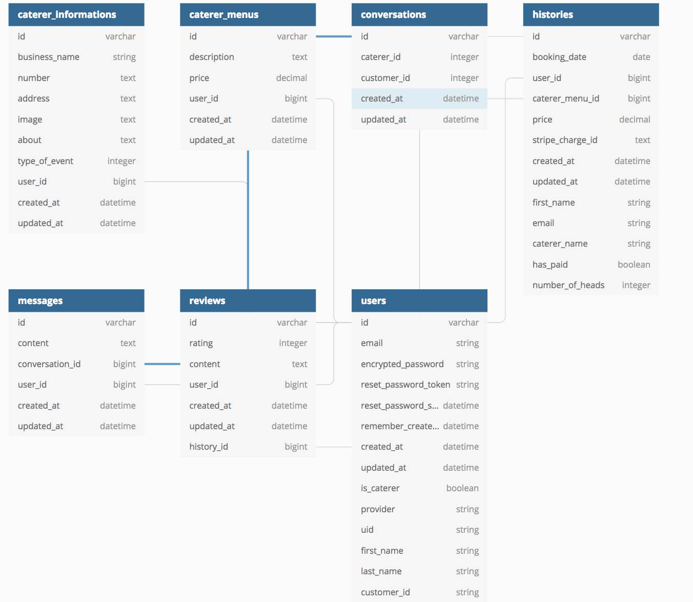

## Answers to the Short Answer questions

1. What is the need (i.e. challenge) that you will be addressing in your project?

	When people are organising an event, there are several different things that must be considered. One of the most crucial; what food will there be. This is a decision that can take hours, pouring over individual caterer websites, reading reviews and comparing prices. Through the implementation of our app, CaterLog, we are addressing the need for customers to have access to all caterers in Sydney, in one convenient location, saving them time and money. 
	
	Similarly, on the caterer side, CaterLog provides a platform for caterers to offer their services to potential customers.
	
2. Identify the problem you’re trying to solve by building this particular marketplace App? Why is it a problem that needs solving?

	Currently, the catering industry in Sydney lacks a central two-sided marketplace, where customers can find caterers based on area of expertise. CaterLog aims to bridge the gap between customer and caterer, in a mutually beneficial style. Customers now have access to all caterers in Sydney, categorised according to expertise. They are able to compare menus, price and reviews in a matter of minutes. Caterers are now able to make themselves available to customers. They will be able to select the necessary category, explain a bit about themselves, show what menus they offer; then let the reviews do the talking.

3. Describe the project will you be conducting and how your App will address the needs.

	CaterLog will be a central location for caterers to list their catering menus - setting menu options and pricing. Customers looking for caterers for their events will be able to book a caterer, and are charged for a set price depending on the price per person and the number of people to be catered for. To allow for a two-sided experience, there will be a instant messaging feature to allow for two-way communication between customers and caterers and a review system to showcase their reputation. 

4. Describe the network infrastructure the App may be based on.

	The development of caterlog was confined locally to our machines. Specific features of the app were allocated and worked on individually. To gain access and see the changes to our app during development, we ran the puma server which comes packaged with rails by configuring the rails server in the command line and accessing the web address http://0.0.0.0:3000/. Once ready to implement, the features were merged into the developing app using github. For production, heroku was used to deploy the app. Heroku is a cloud application platform which hosts our app on a separate external servers and gives users secure access by assigning an https URL. Therefore heroku eliminates the need for a DNS setup to production.

5. Identify and describe the software to be used in your App.

	CaterLog is built with the Ruby on Rails development framework. The framework comes with a multitude of pre-packaged functionality. A rails application generates a file structure that is easy to navigate and follows the Model-View-Controller architecture, and facilitates routing of HTTP requests. It comes packaged with its own internal server called puma - which allows the app to be accessed locally during the development process, as well as the ActiveRecord database mapping system which allows access and interaction with a preconfigured database. Rails also allows for the Implementation of external ruby programs called gems into an application, which allow for out of the box features such as payment processing and user authentication.  

6. Identify the database to be used in your App and provide a justification for your choice.

	For our app we will use a postgresql database to store data in a normalised fashion . As we will be deploying multiple models and establishing associations with a postgresql database it will allow us to uses primary keys to uniquely identify each row (record) in a table, and foreign keys to assure the referential associations between two related models, therefore making the database object-relational.

7. Identify and describe the production database setup (i.e. postgres instance).
	
	As SQLite is the default configuration of a rails application database, configuring CaterLog to a postgreSQl database involved altering the setup through the command line rails new cater_log -d postgresql to set it as the default database. This change is rendered and can be viewed on the config/database.yml file.

8. Describe the architecture of your App.

	The app is built with the Ruby programming language on the Rails web framework. Ruby on Rails follows the convention over configuration concept, which decrease the number of decisions that a developer using the framework has to make without losing core functionality. 
	
	The framework adopts the model-view-controller architecture pattern. The model structures data and prepares it for controller action, the view displays data to the user in human-readable format, and the controller sends commands to the model to update data as well as sending instructions to update the view.

	The puma web server comes packaged with rails, which is used to accept requests from the browser. Whilst under development CaterLog can be accessed locally from the web address http://0.0.0.0:3000/ as it listens for requests on port 3000
	CaterLog utilises gems, which are external ruby programs that facilitate
	additional functionality. Such gems include devise (for user authentication), carrierwave and mini_magick (image uploading), carrierwave-aws (image storing), stripe (payment), mailgun (sending emails), and others that play less important roles.

9. Explain the different high-level components (abstractions) in your App.

	CaterLog has the following models (user, review, message, history, conversation, caterer_menu, caterer_information). 
	The app takes signs ups from two types of users; caterers and customers looking for a caterer. To differentiate the type of user,the is_caterer column in the user table is set to a boolean value matching the type of user.

	When a caterer signs up they are taken to a form which allows them to submit their catering menu/s. The details of the caterer are stored in the caterer_information model, whilst the details of their menu listings are stored in the caterer_menu model. The caterer can only have one caterer_information, whilst they can have_many caterer_menus. Both caterer_information and caterer_menu belong_to the caterer.

	When a customer signs up, they are taken to a page, showing all caterers, so they can begin booking. When a customer completes a booking, the details of the booking are saved in the history database. Part of the entry is a column called has_paid. This is a boolean value that defaults to false (through a function created in the history model), and only changes to true when the user completes the stripe payment on the next screen. This payment also saves a stripe_charge_id, so a refund function can be implemented down the track.

	After the booking_date has passed in the history model, a customer is able to add a review for the service they received. This review belongs_to the specific history, whilst the history can only have one review. The history id is stored in the review database, so that the caterer_information can be accessed and displayed in the review view.
	Another feature on our application is an instant messaging system. This encompasses both the conversation and message databases. Only a customer can begin a conversation (by clicking on the ‘enquire’ button of the caterer they wish to talk to), and they can only talk to a caterer. Whilst a caterer can only talk to a customer, and can only chat when the conversation has been initialised. This was achieved through the use of a customer_id and a caterer_id in the conversation model. They both draw from the user database, and use is_caterer to work out which column they should be in. The messages database belongs_to the conversation, as every message a user sends will be to someone.

10. Detail any third party services that your App will use.

	Third party services that were used in the production of CaterLog include the following gems that provide extra functionality and security to the app:

	* Devise: Allows users to signup, signin and log out securely, by storing their encrypted password and providing a level of validation and authentication. They also provide additional features, such as the ability to mail the user a link to reset their password
	* Carrierwave/mini_magick: Allow files to be uploaded and configured. CaterLog used these services to enable the caterers an easy way to upload a profile image
	* Carrierwave-aws: Host uploaded images on Amazon Web Services cloud services platform. This was used to securely store images that are uploaded into CaterLog. 
	* Stripe: Facilitate transactions between individuals and businesses in a secure manner. Through stripe, customers can feel safe, as their sensitive data is stored in an extremely secure manner, whilst caterers are easily able to receive their payments into their stripe account, where they will remain safe
	* Mailgun: Enables dynamic emails to be sent to users depending on certain actions. CaterLog has implemented Mailgun to send reset password information and to send a successful booking email to customers and caterers upon booking completion 

11. Describe (in general terms) the data structure of marketplace apps that are similar to your own (e.g. eBay, Airbnb).

	CaterCow and UberEats are two-sided marketplace apps, which have similar data structures. They both have users looking for a service, and users providing a service. Depending on which side of the marketplace a user sits, they will have different access to different parts of the website.

12. Discuss the database relations to be implemented.

	CaterLog bases all models around the User database. All databases either belong_to or have_one user. This allows easy access to any information about a user throughout the app. This is made even more powerful, as the User table has an is_caterer boolean, which will let CaterLog know if the user has signed up as a customer or a caterer. 

	Looking from the User out, the User either has_one or has_many of the other databases. The has_one is used for Caterer_information to prevent the user from creating multiple accounts, whilst the has_many relationship is used for all other databases to provide flexibility for the user and for the app as a whole.

13. Describe your project’s models in terms of the relationships (active record associations) they have with each other.

	Review, Message, Conversation, History, Caterer_information and Caterer_menu all belong to User. These relations allow CaterLog to easily access many features, as the User is the centre of the app. For example, CaterLog is easily able to print all menus related to a user by using ‘User.first.cater_menus’. Similarly, ‘User.first.conversations’ will show all messages relating to the user, and will save alot of database querying.

	Other relations include Message belonging to Conversation. This allows the specific messages that have been sent in a conversation to be displayed with ease. Similarly, Review belongs to History, as a booking must have occured before a customer can leave a review for a caterer. Taking this further, History belongs_to Caterer_menu, so CaterLog can keep track of a menus total rating through Review -> History -> CatererMenu.

14. Provide your database schema design.

	

15. Provide User stories for your App.

	* As a customer I want to be able to view the profile of caterers so I can see a description of their work.
	* As a customer, I want to be able to view my history of  caterers.
	* As a caterer, I want users to be able to access my profile and find out basic information about me.
	* As a caterer, I want to be notified when users are attempting to contact me.
	* As a customer, I want a messaging system to make initial contact with a caterer.
	* As a customer, I want to easily sign-up for an account, without having to jump through too many hoops
	* As a caterer or a customer, I want to know that my information is protected
	* As a customer, I want to be able to see reviews from other customers
	* As an admin, I want the ability to monitor reviews and messages, and delete any inappropriate content

16. Provide Wireframes for your App.

	[Wireframe Mobile](CaterLog-Mobile-View.png)

	[Wireframe Desktop 1](CaterLog-Desktop-Home-Page.png)

	[Wireframe Desktop 2](CaterLog-Desktop-Sign-In-Caterer.png)

	[Wireframe Desktop 3](CaterLog-Desktop-Customer.png)

17. Describe the way tasks are allocated and tracked in your project.

	Each morning, our group has a stand up type of meeting to quickly discuss the workload of each person for the day. We then spend the first hour of the day to help each other to fix issues that have occurred in the previous day, then we break to work on our own workload. We get together again before the day ends to discuss the workload status and regroup again the following morning.

18. Discuss how Agile methodology is being implemented in your project.

	Our group is seated together throughout the project. This is for our ease of communication between each other if there are any issues or anything we need to discuss. We have also utilised slack as another mean of communication for when we are not in a room together.

	Tasks are managed on our trello board and updated as we progress.
	An estimate of each task was managed in a gantt chart. 
	A stand up meeting every morning

19. Provide an overview and description of your Source control process.

	CaterLog used github for it’s source control process during development. All team members would work on seperate features on their local machines, on a branch named after their feature. When they had completed a feature, they would push these changes up to github, and would merge these changes to the master. They would then git checkout to their master and git pull, to ensure they had the most up-to-date code.

	Initially, the development team at CaterLog tried using a development branch, where all changes would be merged, and the master would be untouched. However, upon realising the scope of their project, they saw this as an unnecessary work around, and decided to merge straight to the master.

20. Provide an overview and description of your Testing process.

	We have manually tested our website for different user cases, as shown in the links below.

	[Link to test case 1](test-case-1.png)

	[Link to test case 2](test-case-2.png)
	

21. Discuss and analyse requirements related to information system security.

  CaterLog takes an incredible serious and strict stance when it comes to the security of information. They aim to keep user information confidential, available and ensure the integrity of the information.

  Using third party services such as Devise, Stripe and Carrierwave-AWS enable CaterLog to keep information confidential. Devise uses Bcrypt, a password-hashing function, to store user passwords and password reset keys as encrypted strings, preventing access to this sensitive information. Stripe encrypts and stores user credit card details in an external database, meaning even if CaterLog was compromised, this information would never make it into the wrong hands. Carrierwave-AWS allows CaterLog to store all file uploads on an Amazon Server, once again preventing the risk of attack.

  It is all well and good to keep information safe, but CaterLog ensures that information is available to the right people at the right time. This is achieved through authorisation, through Devise and through database tables. A user must enter the correct credentials into the devise log in screen to gain access to certain features of the app. If these details are forgotten, the user can work through the steps to recover them, and gain access to the information. Database columns such as ‘is_caterer’ and ‘has_paid’ ensure only caterers gain access to caterer features, whilst only customers can book caterers. Similarly, ‘has_paid’ is a boolean that does not allow a booking to go ahead, unless the customer has completed successful payment.
	
  CaterLog uses rails forms, which have an incredible security feature built in, to protect the integrity of information sent in between routes; a CSRF token. This token is unique per request, and prevents any information manipulation as the data is posted. The token creates a random hash, which the receiving response will expect to receive. If the data is intercepted and manipulated, the token will change, and the receiving page will reject it.

22. Discuss methods you will use to protect information and data.

	CaterLog will authenticate all users before they can send or access sensitive information. An unregistered user will be able to browse, but will be unable to fully interact with the site until they have been authorised. This authorisation will occur through Devise, which will keep authorisation details safe.

	The data of users already stored in the database will remain safe through the use of data sanitisation. Rails provides form sanitation ‘out-of-the-box’, which CaterLog has used to prevent malicious attacks.

	Lastly, storing credit card details and files externally, through Stripe and Carrierwave-AWS respectively, ensures sensitive information and data provided by the users will remain safe and protected.

23. Research what your legal obligations are in relation to handling user data.

	Whilst CaterLog does not fall under the Privacy Act, we still have certain obligations when it comes to handling user data. This becomes more complex, as the data becomes more sensitive.

	During the signup form, CaterLog requires a first and last name, an email and a password. If the user is a caterer, they end up entering details about their address, phone number and business name. This meets the principles of the Privacy Act, as all collected information is essential for the function of the business. However, whilst it is reasonable to collect such data, CaterLog must also securely handle the data, as any data breach is the responsibility of the business holding the data.

	When it comes to credit cards, the handling becomes increasingly important. Although CaterLog minimises this risk by passing all details straight to Stripe, it is still important to note what responsibilities are still held. It is important to have data retention and disposal policies, procedures and processes. Some data must be held for a minimum of 3 months, to ensure payment is successful, but must be disposed of after that. 